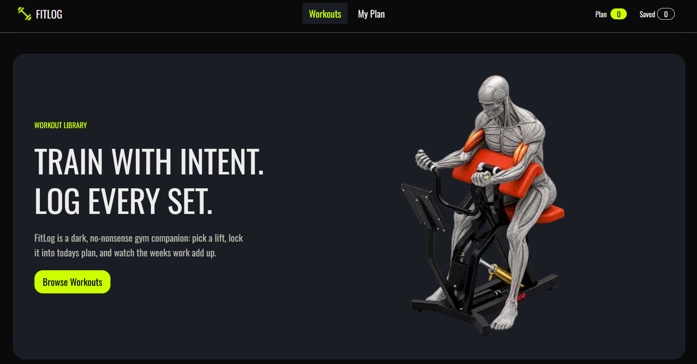

# 🏋️ FitLog - Personal Workout Planning & Tracking Application using Next.js

**FitLog** is a modern, interactive workout planning and tracking application designed to make it easier to discover workouts, build a personal workout plan, and keep track of saved exercises.

The application provides a clean, dark-themed UI focused on simplicity and usability — helping users spend less time managing workouts and more time training.

## 📸 Preview

## 🛠️ Tech Stack

- **React**
- **Next.js**
- **TypeScript**
- **Tailwind CSS**
- **DaisyUI**
- **React-Toastify**
- **React Icons**

## ✨ Features

- 🏋️ **Workout Library:** Browse a collection of workouts and exercises.

- 📋 **Personal Workout Plan:** Add workouts to your personal plan and organize your exercises for today.

- 💾 **Save Workouts:** Save workouts for quick access later.

- 📊 **Workout Sorting:** Sort workouts based on different criteria such as:
  - Duration
  - Calories
  - Rating

- 📱 **Responsive Design:** Designed to work across desktop, tablet, and mobile devices smoothly.

- ⚡ **Fast & Interactive UI:** Built with modern React and Next.js architecture.
